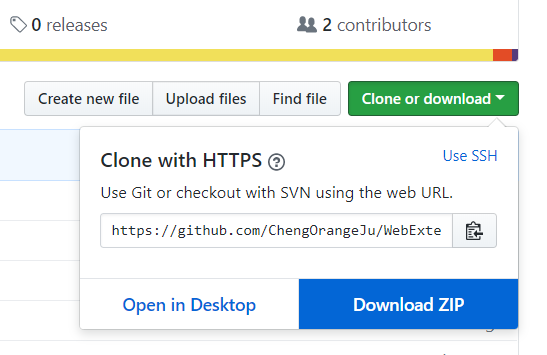
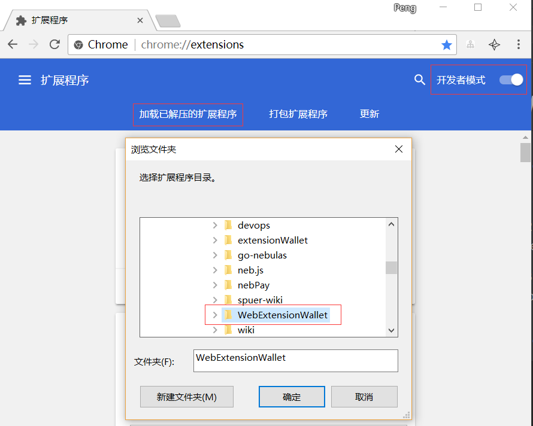

# WebExtensionWallet

### 1. Install

(1) clone the repo into your local environment or download as a ZIP file.

  

(2) Open your chrome browser, go to chrome://extensions/ and check the box for Developer mode in the top right.

(3) Click the Load unpacked extension button and select your local repo folder for your extension.

  


### 2. Brief introduction of using our ExtensionWallet
```
(1) In tab `New-Wallet`, you can create your own wallet, and download the keystore files.
(2) In tab `Send-TX`, you can import your keystore file, and then your account will be stored within the extension.
(3) After your account keyfile is imported, you can send NAS to other account address.
(4) After a transaction is sent, you got the transaction hash shown at the bottom of extension page.
(5) Click the transaction hash in tab `Send-TX` to check transaction status
(6) Another way to check your transaction status is to copy your transaction hash to `check-TX` to view the result.
```

### 3. Instructions on how to use WebExtensionApp in your webapp

Now WebExtensionApp supports two different ways to communicate with Dapp page.

#### 3.1 Using `postMessage`

When developing your Dapp page, you can use `postMessage` API to communicate with ExtensionWallet, and use `window.addEventListener` to listen the message answer. Just as the example below.

To call a smart contract function with extensionWallet, you should use `postMessage` to send a message as below:
```js
window.postMessage({
    "target": "contentscript",
    "data":{
        "to": to,
        "value": "0",
        "contract":{  //"contract" is a parameter used to deploy a contract or call a smart contract function
            "function":func,
            "args":para
        }
    },
    "method": "neb_sendTransaction",
}, "*");
```

And then you need to add an `eventlistener` to listen the returned message.
```js
window.addEventListener('message', function(e) {
     console.log("message received, msg.data: " + JSON.stringify(e.data));
     if(!!e.data.data.txhash){
         console.log( "Transaction hash:\n" +  JSON.stringify(e.data.data.txhash,null,'\t'));
     }
})
```

#### 3.2 Using NebPay SDK

Please refer to Dapp Example [SuperDictionary](https://github.com/15010159959/super-dictionary) to learn how to use this extension.
 
When developing your Dapp page, you can also use [NebPay SDK](https://github.com/nebulasio/nebPay) to communicate with ExtensionWallet. Just as the example below.

To call a SmartContract through extensionWallet, you should use [`nebpay.call`](https://github.com/nebulasio/nebPay/blob/master/doc/NebPay_Introduction.md#call) or [`nebpay.simulateCall`](https://github.com/nebulasio/nebPay/blob/master/doc/NebPay_Introduction.md#simulatecall) to send a transaction as below:
```js
nebPay.call(to, value, callFunction, callArgs, {
    qrcode: {
        showQRCode: true
    },
    listener: cbCallDapp //specify a listener to handle the transaction result
});

function cbCallDapp(resp){
        console.log("response: " + JSON.stringify(resp))
    }
    
```

### example page
And you can use `example/TestPage.html` to take a test.


